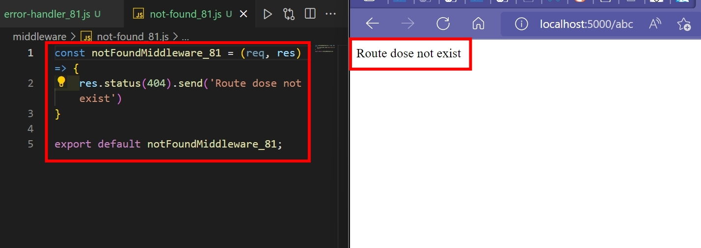
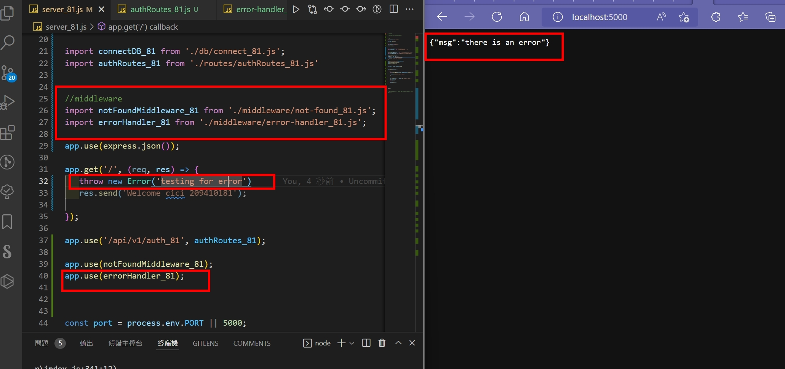
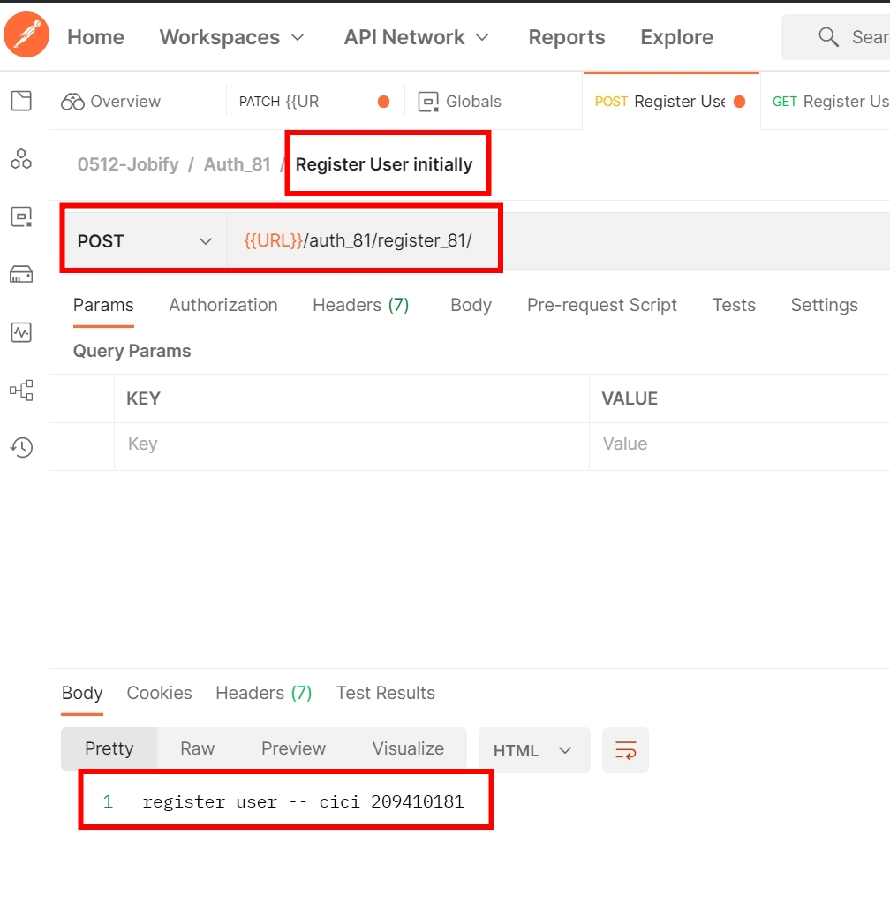
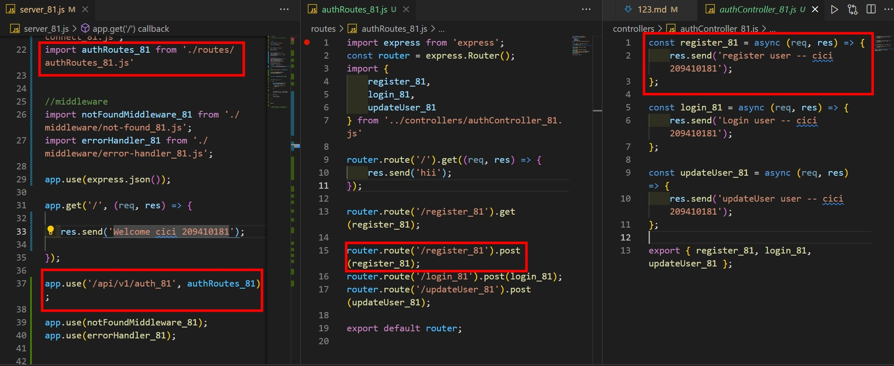
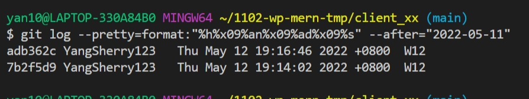

### w12-p1 switch Register and Login, and log

### w12-p2-1 test for notFoundMiddleware_81.js

### w12-p2-2 test for errorHandlerMiddleware_81.js

### w12-p3 Use postman to test route /api/v1/auth_81/register_81

### GIT LOG

