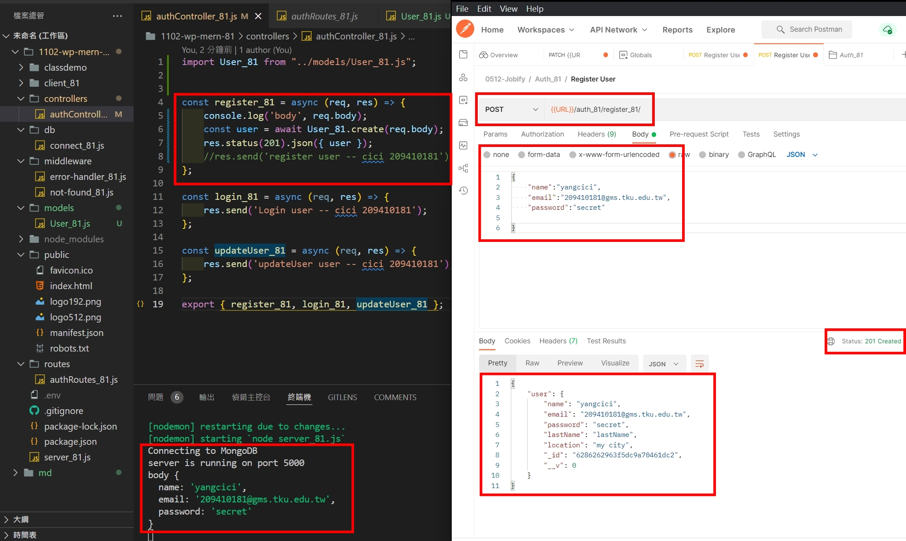
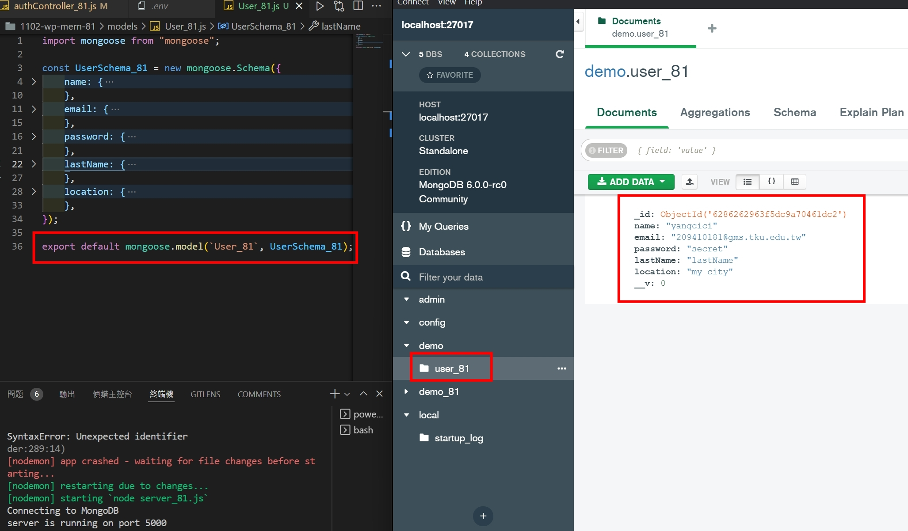
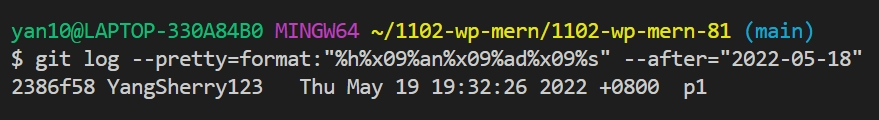
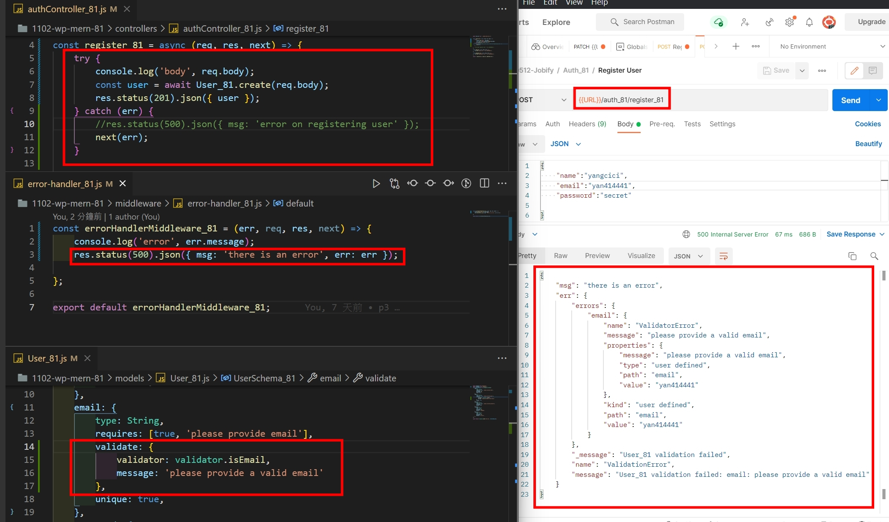
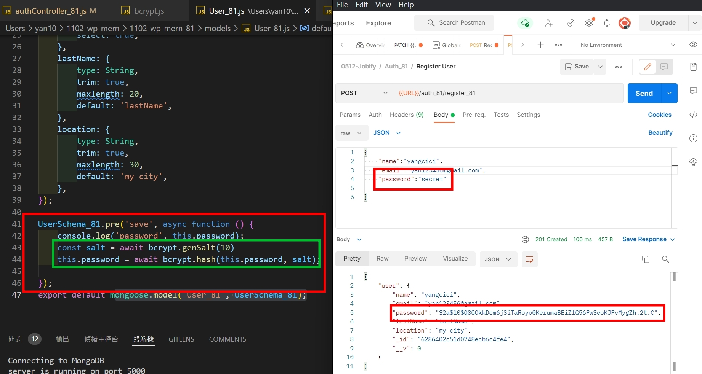
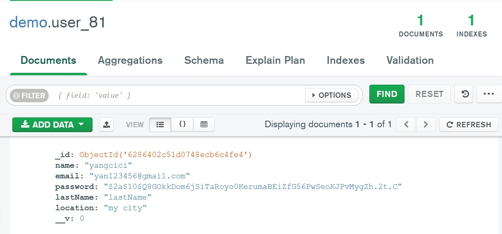
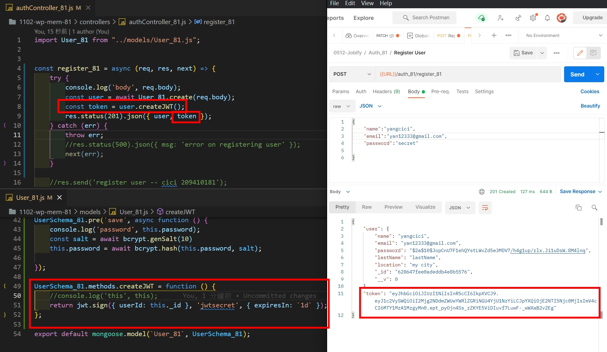
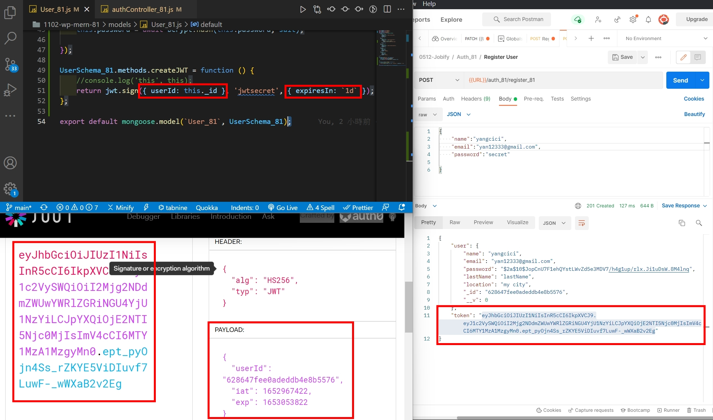
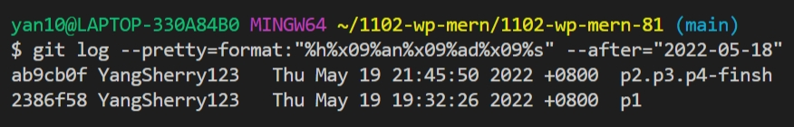

### w13-p1: create a user and save it into MongoDB, collection User_81

### w13-p2: use validator package to check email, error sent to error-handler_81.js

### w13-p3: hash password using bcryptjs

### w13-p4: create jwt token using bcryptjs

### p13-last-log

