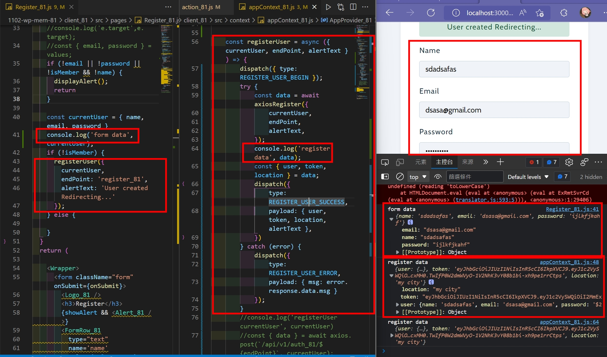
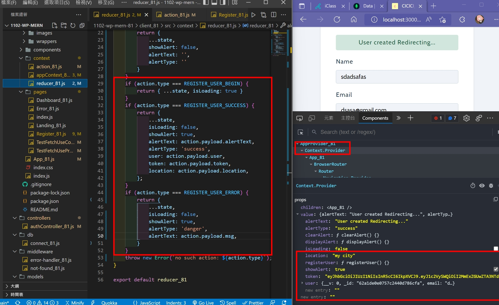
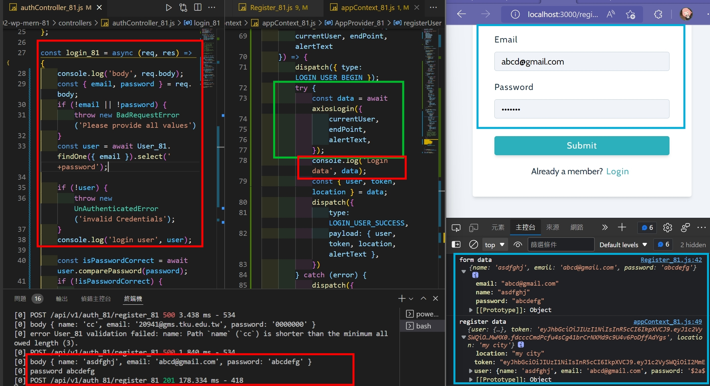
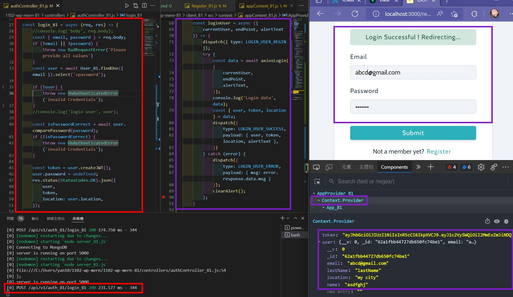
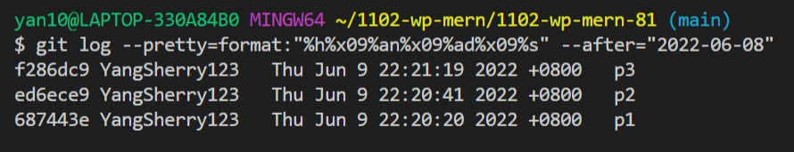

### w16-p1: registerUser okay, save { user, token, location} in appContext

### w16-p2: loginUser from client to server, test connection okay

### w16-p3: in server, check email and password for credentials, okay then return {user, token, location}

### p16-last-log

