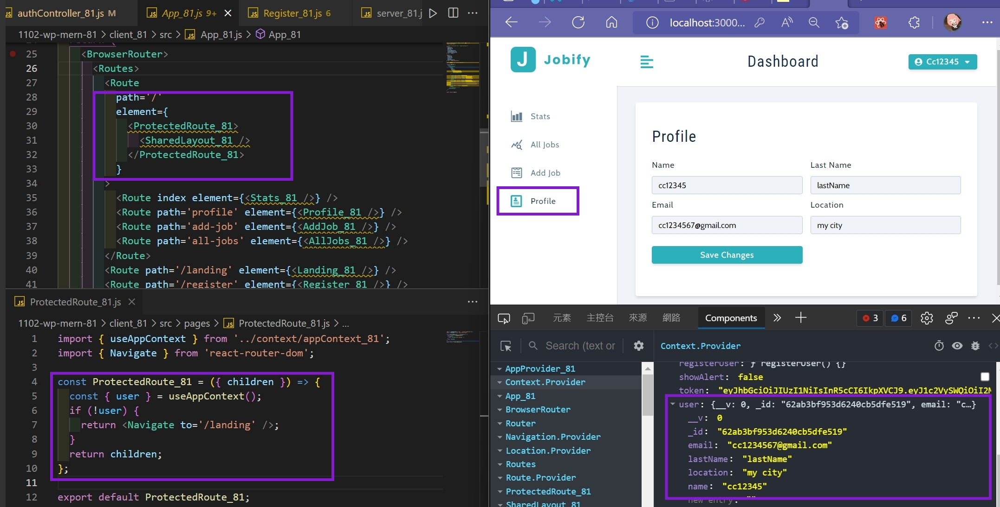
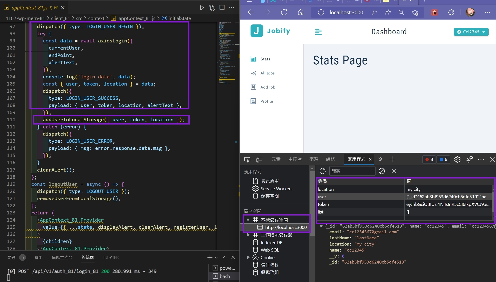
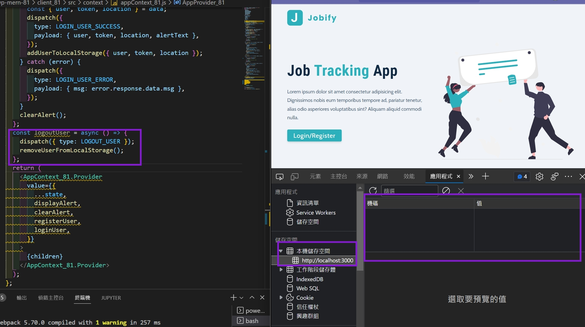
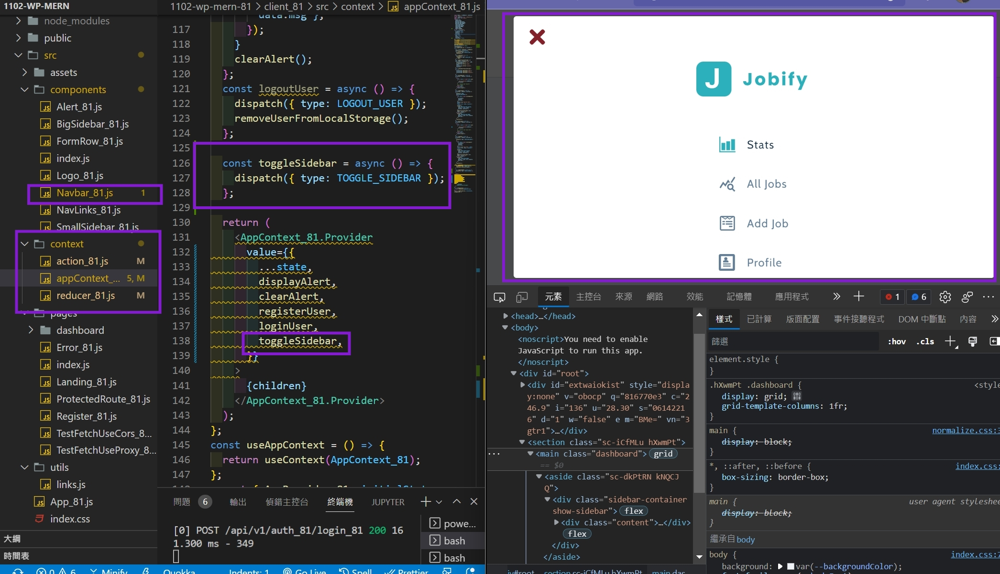
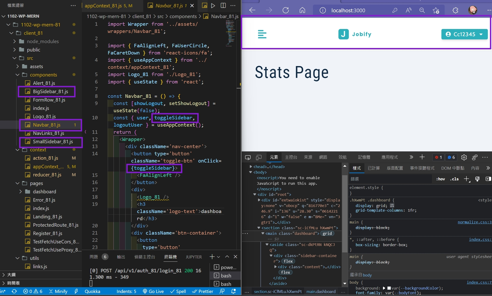
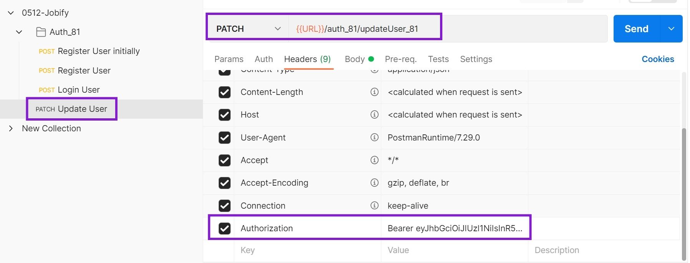
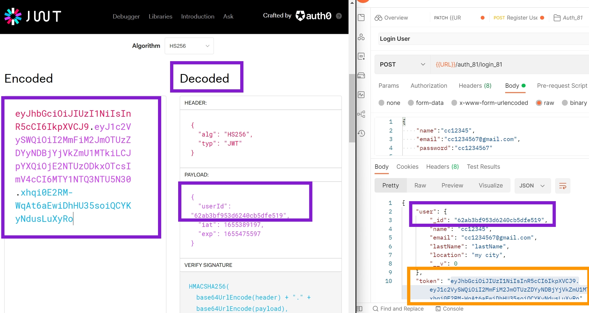
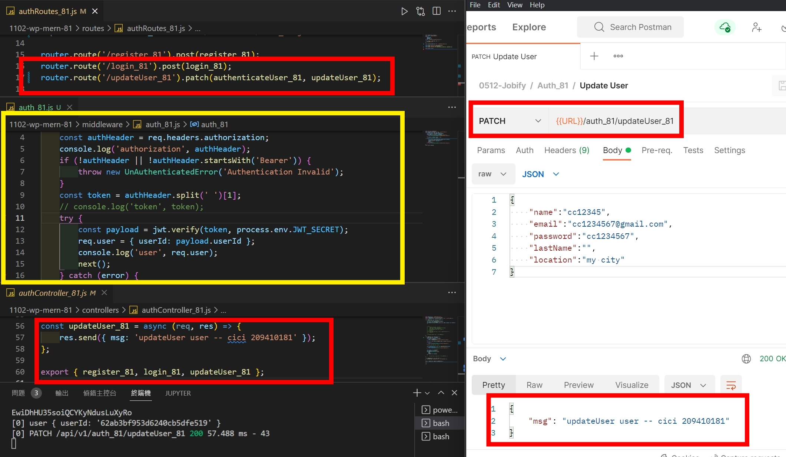
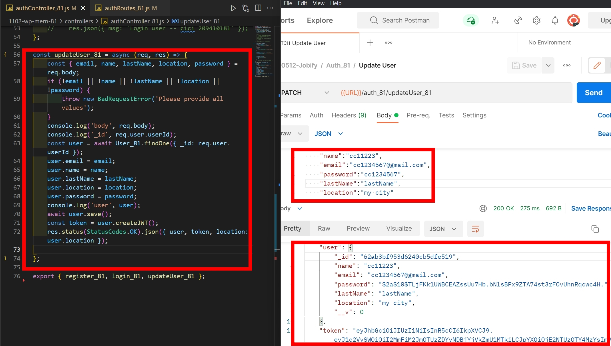
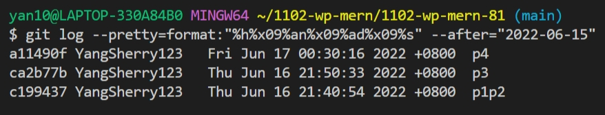

### w17-p1: after login in, direct to protected route of dashboard

### w17-p2: implement logout user, remove local stroage data

### w17-p3: toggle sidebar (SmallSidebar and BigSidebar)

### w17-p4: server authentication and updateUser

### Git Log
